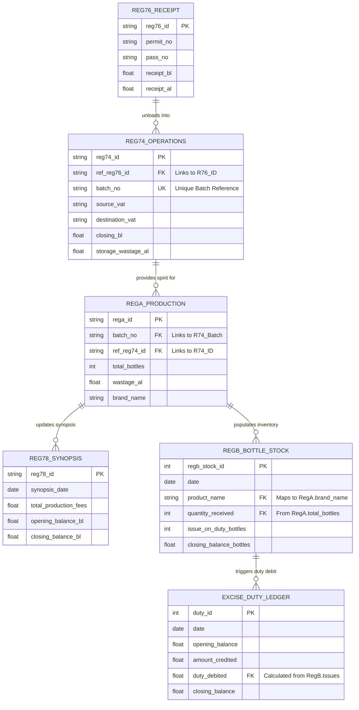

# 🗄️ Excise System Database Schema & Data Relationships

This document details the hybrid database structure (SQLite + CSV) and the relational links that power the automation "Ripple Effect".

## 📊 Entity Relationship Diagram (ERD)

## 🛠️ Data Storage Breakdown

### **1. Filesystem CSV (Operational Data)**
These files track the high-volume, real-time physical movement of spirit.
- `reg76_data.csv`: Tanker Arrivals.
- `reg74_data.csv`: Spirit Storage & Blending (The Base Registry).
- `rega_data.csv`: Daily Bottling & Production Efficiency.
- `reg78_data.csv`: Daily Consolidated Synopsis.

### **2. SQLite Database: `excise_registers.db` (Ledger Data)**
Used for relational tracking, historical inventory, and financial balances.
- `regb_bottle_stock`: Finished goods inventory tracking.
- `regb_production_fees`: Tracking the ₹3/bottle fee account.
- `excise_duty_ledger`: Primary government financial account.
- `excise_duty_bottles`: Specific duty calculations per brand issued.

## 🔗 Key Relational Hooks

| Linkage | From Field | To Field | Purpose |
| :--- | :--- | :--- | :--- |
| **Receipt Link** | `reg76_data.permit_no` | `reg74_data.permit_no` | Ensures tanker data flows to unloading. |
| **Batch Link** | `reg74_data.batch_no` | `rega_data.batch_no` | Ensures production pulls from correct blend. |
| **Inventory Link**| `rega_data.brand_name` | `regb_stock.product_name` | Auto-adds production to Warehouse stock. |
| **Synopsis Link** | `rega_data.production_date`| `reg78_data.synopsis_date` | Auto-calculates daily fees and wastage. |
| **Duty Link** | `regb_stock.issue_on_duty` | `duty_ledger.duty_debited` | Auto-calculates tax when bottles leave godown. |

---
**Document Status**: ✅ Integrated  
**Version**: 2.0  
**Archirect**: Antigravity AI
