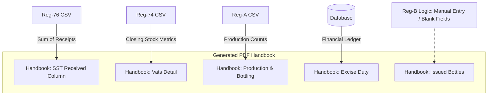

# 🔄 Handbook Data Integration Map

## Overview
This document outlines the automated data flow between the individual Excise Registers (Reg-76, Reg-74, Reg-A, Reg-B, Excise Duty) and the **Daily Handbook Generator**.

The Handbook Generator acts as a **central aggregator**, pulling data from various sources (CSV files and SQLite Database) to produce the final printable PDF for any given date.

---

## 🗺️ Data Connection Map

### 1. Reg-76 (Spirit Receipt Register)
*   **Status**: ✅ **Auto-Filled**
*   **Source**: `reg76_data.csv`
*   **Handbook Section**: **SST & BRT Detail** (Column: *Received (A.L.)*)
*   **Logic**:
    *   The generator scans for receipts where `Receipt Date` matches the Handbook Date.
    *   It identifies the **Storage Vat** (e.g., SST-5) specified in the receipt.
    *   It sums the `Received A.L.` (`rec_al`) for that vat.
    *   **Result**: The value appears in the "Received (A.L.)" column for the corresponding vat row.

### 2. Reg-74 (Spirit Operations Register)
*   **Status**: ✅ **Auto-Filled**
*   **Source**: `reg74_data.csv`
*   **Handbook Section**: **SST & BRT Detail** (Stock Columns)
*   **Logic**:
    *   The generator looks for the **latest operation** for *each* vat (SST-5 to BRT-17) on or before the Handbook Date.
    *   It captures the closing parameters from that operation.
    *   **Mapped Fields**:
        *   `Dip (cm)` ← `dip_reading_cm`
        *   `B.L.` ← `closing_bl`
        *   `Strength` ← `closing_strength`
        *   `A.L.` ← `closing_al`

### 3. Reg-A (Bottling Production Register)
*   **Status**: ✅ **Auto-Filled**
*   **Source**: `rega_data.csv`
*   **Handbook Sections**: 
    1. **Production Detail**
    2. **Bottling Line**
*   **Logic**:
    *   The generator filters for production records matching the Handbook Date.
    *   It aggregates data by **Bottling Line**.
    *   **Mapped Fields**:
        *   `IML Bottles` (750ml, 375ml, 180ml) ← `bottles_750ml`, `bottles_375ml`, `bottles_180ml`
        *   `Production in A.L.` ← `bottles_al`
        *   `Production Wastage (A.L.)` ← `wastage_al`
        *   `Nominal Strength` ← `strength`

### 4. Reg-B (Bottle Issue Register)
*   **Status**: ✏️ **Manual Entry (Design Choice)**
*   **Source**: N/A (Intentionally disconnected)
*   **Handbook Section**: **Issued Bottle Details**
*   **Logic**:
    *   Although the system *can* fetch data, this section is strictly configured to generate **Blank Fields**.
    *   This allows for manual recording of:
        *   Opening Balance
        *   Quantity Received
        *   Wastage/Breakage
        *   Issue on Payment
        *   Closing Balance

### 5. Excise Duty Ledger
*   **Status**: ✅ **Auto-Filled**
*   **Source**: `excise_registers.db` (Table: `excise_duty_ledger`)
*   **Handbook Section**: **Excise Duty Detail**
*   **Logic**:
    *   The generator queries the database for the entry matching the Handbook Date.
    *   **Mapped Fields**:
        *   `Opening Balance` ← `opening_balance`
        *   `Deposit Amount` ← `deposit_amount`
        *   `Total Credited` ← `total_credited`
        *   `Bottles Issued (A.L.)` ← `issued_al` (Derived/Calculated)
        *   `Duty Debited` ← `duty_amount`
        *   `Closing Balance` ← `closing_balance`

---

## 📊 Visual Data Flow Summary

## 📝 Notes for Future
*   **Reg-78 (Production Fees)**: Currently, the system *does* have logic to pull from `reg78_data.csv` for the "Production Fee's Detail" section, mapping opening/closing balances and fee debits. This can be reviewed/refined later as per requirements.
