# 🗺️ Excise Parallel Register System - Data Flow Diagram

This flowchart illustrates the "Ripple Effect" automation where data entered in the base registers automatically populates the downstream documents.

```mermaid
graph TD
    %% Base Receipts
    R76[<b>Reg-76: Spirit Receipt</b><br/>Tanker Arrival & Unloading] -->|Permit/Pass Nos| R74
    
    %% Base Register (The Heart)
    subgraph Base_Register_Operations
        R74[<b>Reg-74: Spirit Operations</b><br/>Base Register - The Source of Truth]
        R74 -->|Dip & Stock| SST[SST Vats 5-10]
        R74 -->|Blending/Reduction| BRT[BRT Vats 11-17]
        R74 -->|Storage Wastage| R78
    end

    %% Production Ripple
    BRT -->|Available Batches| RA[<b>Reg-A: Production</b>]
    
    subgraph Production_Automation
        RA -->|MFM2 vs Bottles| RA_W[Production Wastage]
        RA -->|Brand/Total Bottles| RB[<b>Reg-B: Finished Stock</b>]
        RA -->|Qty Produced| R78[<b>Reg-78: Daily Synopsis</b>]
    end

    %% Inventory & Fees Ripple
    subgraph Inventory_Financial_Automation
        RB -->|₹3 per Bottle| RB_F[Production Fees]
        RB -->|Issue on Payment| ED[<b>Excise Duty Register</b>]
        ED -->|Duty Debit| ED_L[Financial Ledger]
    end

    %% Final Consolidation
    R78 -->|Consolidated Data| HB[<b>📚 DAILY HANDBOOK V2</b>]
    RA  -->|Production Detail| HB
    R74 -->|Base Stock Detail| HB
    RB  -->|Inventory Detail| HB
    ED  -->|Financial Detail| HB

    %% Styling
    style R74 fill:#f9f,stroke:#333,stroke-width:4px
    style HB fill:#f4b942,stroke:#333,stroke-width:2px,color:#000
    style ED fill:#85c1e9,stroke:#333,stroke-width:2px
    style RA fill:#d1fae5,stroke:#333,stroke-width:2px
```

---

## 📋 Data Flow Descriptions

### **Phase 1: Receipt (Reg-76)**
- **Input:** Tanker details, Permit Number, Pass Number, Dip readings.
- **Automation:** This data is pushed to Reg-74 for the "Unload" operation.

### **Phase 2: Base Operations (Reg-74)**
- **Input:** VAT transfers, Blending, Reduction.
- **Role:** This is the **BASE REGISTER**.
- **Automation:** 
  - Updates SST/BRT stock levels.
  - Generates Batch Numbers for Reg-A.
  - Reports storage wastage to Reg-78.

### **Phase 3: Bottling (Reg-A)**
- **Input:** Batch selection (from Reg-74), MFM2 readings, Bottle counts.
- **Automation:**
  - Updates the Reg-78 Synopsis automatically.
  - Feeds finished bottle counts to Reg-B.
  - Calculates production efficiency (MFM2 vs Bottles).

### **Phase 4: Inventory & Fees (Reg-B)**
- **Input:** Opening stock (auto-carried), Received Stock (from Reg-A).
- **Automation:**
  - Calculates and tracks ₹3/- per bottle Production Fees.
  - Triggers the Excise Duty Register when bottles are issued.

### **Phase 5: Financials (Excise Duty)**
- **Input:** Issues on payment (from Reg-B).
- **Automation:**
  - Calculates Duty based on Strength and BL.
  - Manages the Debit/Credit ledger of your primary government account.

### **Phase 6: Reporting (Daily Handbook)**
- **Input:** One-click "System-Wide Sync".
- **Result:** A professional 6-section PDF consolidating the entire day's operations from Spirit to Cash.

---
**Version**: 2.0 (Automated)  
**Industry**: Distillery Excise Compliance  
**Created for**: SIP2LIFE DISTILLERIES PVT. LTD.
